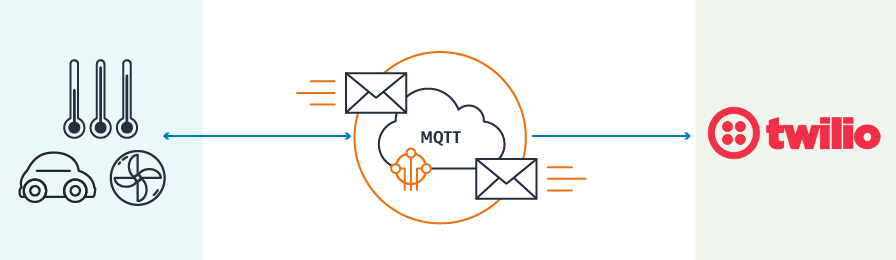

# AWS IoT - Twilio Bridge for AWS Serverless Application Repository

This service provides a bridge between AWS IoT and Twilio for your devices to send messages to Twillio. 



## Table of Contents
* **[What is AWS Serverless Application Repository?](#)**
* **[Use Cases](#)**
* **[Prerequisites](#prerequisites)**
* **[Setup and Use](#)**
* **[License](#license)**

## What is AWS Serverless Application Repository?

## Use Cases
1. Create an alert topic and notify end users directly through Twilio.
1. Alert admins on any event (new devices, high watermark, etc.) or any alert threshold being reached. 

## Prerequisites
1. Sign up for a [Twilio account](http://www.twilio.com)
1. Create a [new phone number](https://www.twilio.com/console/phone-numbers/) in your Twilio account
1. Copy your Account SID and Auth Token from the [Twilio console](https://www.twilio.com/console) 
1. [AWS IoT Topic](http://docs.aws.amazon.com/iot/latest/developerguide/topics.html) which will be used as the trigger for the lambda

## Setup
You will need the following information from the previous steps and configure them in the [template.yaml](template.yaml) file
1. AccountSID - Account SID for Twilio account.
1. AuthToken - AuthToken for Twilio account.
1. IncomingTopic - The topic that will be used as the trigger for the lambda.
1. FromNumber - The phone number the message is coming from.

## Use 

The following Input Format is expected from the IoT Topic to trigger the Twilio Workflow
```
{
    "deviceID": "deviceID123",
    "incomingText": "Text From Device"
    "toNumber": "+1xxxxxxxxxx"
}
```

## License
This is released under the MIT license. Details can be found in the [LICENSE](LICENSE.md) file.
